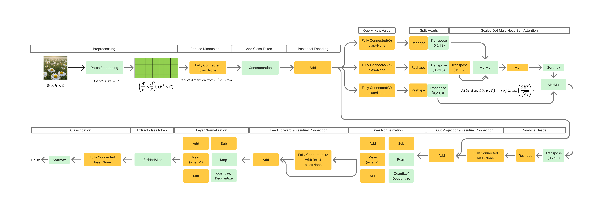

# stm32n6-transformer

[Paper(korean)(coming soon)](https://www.dbpia.co.kr/) | [Slides(en)](https://github.com/minchoCoin/stm32n6-transformer/blob/main/assets/stm32n6_transformer.pdf) | [Presentation Video(en)](https://youtu.be/kBkvOu6LNUI)

Official repository of 'Implementation and Performance Evaluation of Vision Transformer Model
Based on MCU-NPU' (KICS winter conference 2026)

keyword: NPU, STM32N6, MCU, Transformer, Vision Transformer

# source code tree
```
├─firmware
    ├─app_config.h
    ├─main.c
├─make_model
    ├─transformer_npu.py
    ├─transformer_npu_v2.py
└─prebuilt_binary
    ├─v1
        ├─custom_vit_ln_im160_attdim144_depth6_head4_ff576.tflite
        ├─network_data.hex
        ├─STM32N6570-DK_GettingStarted_ImageClassification_sign.bin
    └─v2
        ├─v2_custom_vit_ln_im160_attdim144_depth6_head4_ff576.tflite
        ├─network_data.hex
        ├─STM32N6570-DK_GettingStarted_ImageClassification_sign.bin
```

# prebuilt binary and model

## How to use?
1. run STM32CubeProgrammer
2. Connect STM32N6-DK

Port: SWD, Frequency: 8000, Mode: Hot Plug, Access Port:1, Reset mode: Hardware reset

3. flash the ai_fsbl.hex (from [https://github.com/STMicroelectronics/STM32N6-GettingStarted-ImageClassification/releases/tag/v2.1.1](https://github.com/STMicroelectronics/STM32N6-GettingStarted-ImageClassification/releases/tag/v2.1.1))

4. flash the network_data.hex
5. flash the `STM32N6570-DK_GettingStarted_ImageClassification_sign.bin` at `0x70100000`
# quickstart
## requirements
### python library
- kagglehub
- pillow
- tensorflow==2.7.0
### STM
- STEdgeAI v2.2.0
- STM32CubeProgrammer v2.19.0
- STM32CubeIDE v1.19.0
## generate vision transformer tflite file
generate vision transformer with input image size 160, patch size 16, number of classes 5, hidden size D 144, number of layers 6, number of heads 4, MLP size 576, dropout 0.1, using layernorm, and train model 5 epochs
```
python transformer_npu.py --img_size 160 --patch_size 16 --num_classes 5 --d_model 144 --num_blocks 6 --num_heads 4 --d_ff 576 --dropout 0.1 --use_layernorm --epochs 5
```
```
python transformer_npu_v2.py --img_size 160 --patch_size 16 --num_classes 5 --d_model 144 --num_blocks 6 --num_heads 4 --d_ff 576 --dropout 0.1 --use_layernorm --epochs 5
```


## Generate C file from tflite
1. Install [STEdgeAI](https://www.st.com/en/development-tools/stedgeai-core.html), [STM32CubeIDE](https://www.st.com/en/development-tools/stm32cubeide.html), and [STM32CubeProgrammer](https://www.st.com/en/development-tools/stm32cubeprog.html)

1. Add `/c/\<InstallFolder>/Utilities/windows/` in your path to have stedgeai known by your bash(In my case, C:\ST\STEdgeAI\2.2\Utilities\windows).

2. Add `/c/\<InstallFolder>/STM32CubeIDE_<X.X.X>/STM32CubeIDE/plugins/com.st.stm32cube.ide.mcu.externaltools.gnu-tools-for-stm32.<X.X.X>/bin/` in your path to have arm-none-eabi-objcopy known by your bash(In my case, C:\ST\STM32CubeIDE_1.19.0\STM32CubeIDE\plugins\com.st.stm32cube.ide.mcu.externaltools.gnu-tools-for-stm32.13.3.rel1.win32_1.0.0.202411081344).

3. Put you tflite model in the `Model` folder.

4. Generate C file
```bash
cd Model
stedgeai generate --model Model_File.tflite --target stm32n6 --st-neural-art default@user_neuralart_STM32N6570-DK.json
cp st_ai_output/network.c STM32N6570-DK/
cp st_ai_output/network_ecblobs.h STM32N6570-DK/
cp st_ai_output/network_atonbuf.xSPI2.raw STM32N6570-DK/network_data.xSPI2.bin
arm-none-eabi-objcopy -I binary STM32N6570-DK/network_data.xSPI2.bin --change-addresses 0x70380000 -O ihex STM32N6570-DK/network_data.hex
```
then `network.c`, `network_data.hex`, `network_data.xSPI2.bin`, `network_ecblobs.h` will be generated in `./Model/STM32N6570-DK`

## Download and open image classification project
1. download ImageClassification Sourcecode at [https://github.com/STMicroelectronics/STM32N6-GettingStarted-ImageClassification/releases/tag/v2.1.1.zip](https://github.com/STMicroelectronics/STM32N6-GettingStarted-ImageClassification/releases/tag/v2.1.1)
1. run STM32CubeIDE
2. Click File - Open Projects from File System
3. Click Directory and add directory `STM32N6_GettingStarted_ImageClassification-v2.1.1/Application/STM32N6570-DK`
4. Click finish

## change app_config.h and main.c
replace the app_config.h and main.c to files in firmware folder of this repository

then change NN_WIDTH, NN_HEIGHT value to image size, change PATCH_SIZE, NB_CLASSES, classes_table, and welcome message

```c
#define NN_WIDTH      (96) //change
#define NN_HEIGHT     (96)//change
#define NN_BPP 3

#define PATCH_SIZE 16 //change

#define COLOR_BGR (0)
#define COLOR_RGB (1)
#define COLOR_MODE    COLOR_RGB

/* Classes */
#define NB_CLASSES   (5) //change
#define CLASSES_TABLE const char* classes_table[NB_CLASSES] = {\
    "daisy","dandelion","rose","sunflower","tulip"} //change

/* Display */
#define WELCOME_MSG_1         "Vision Transformer.tflite" //change
#define WELCOME_MSG_2         "Model running on NPU" //change

#endif
```
## build project
1. Click Project - Build All

then bin file has been generated at `STM32N6_GettingStarted_ImageClassification-v2.1.1/Application/STM32N6570-DK/STM32CubeIDE/Debug`

## flash the bin and hex files
1. run STM32CubeProgrammer
2. Connect STM32N6-DK

Port: SWD, Frequency: 8000, Mode: Hot Plug, Access Port:1, Reset mode: Hardware reset

3. Flash ai_fsbl.hex at `STM32N6_GettingStarted_ImageClassification-v2.1.1/Binary`

4. Flash network_data.hex
5. Sign the bin file
```bash
STM32_SigningTool_CLI -bin STM32N6570-DK_GettingStarted_ImageClassification.bin -nk -t ssbl -hv 2.3 -o STM32N6570-DK_GettingStarted_ImageClassification_sign.bin
```
6. Flash STM32N6570-DK_GettingStarted_ImageClassification_sign.bin at address `0x70100000`

# Argument of transformer_npu.py
Notes: Arguement of transformer_npu.py and transformer_npu_v2.py are the same

```
python transformer_npu.py [-h] [--img_size IMG_SIZE] [--patch_size PATCH_SIZE] [--num_classes NUM_CLASSES] [--d_model D_MODEL] [--num_blocks NUM_BLOCKS] [--num_heads NUM_HEADS] [--d_ff D_FF][--dropout DROPOUT] [--use_layernorm] [--epochs EPOCHS] [--input_type INPUT_TYPE][--output_type OUTPUT_TYPE]
```
- --img_size : Input image size (default: 224)
- --patch_size : Patch size(default:16)
- --num_classes : Number of classes (default: 5)
- --d_model : Hidden size D (default: 128)
- --num_blocks : Number of Transformer layers (default: 4)
- --num_heads : Number of attention heads (default: 4)
- --d_ff : MLP size(feed-forward MLP network dimension) (default: 256) 
- --dropout : dropout rate(default: 0.1)
- --use_layernorm : use layernorm in transformer block
- --epochs : Number of training epochs (default: 5)
- --input_type : TFLite input type(default: uint8) : float32, int8, uint8
- --output_type : TFLite output type(default: float32) : float32, int8, uint8

## argument guide
- image size should be divisible by patch size
- d_model(hidden size D) should be divisible by num_heads(Number of attention heads)
- we recommend --use_layernorm argument
- we recommend setting --input_type to uint8

# Difference with original ViT
## transformer_npu.py
- Patch Embedding (PE) is configured to be performed in the pre-processing process before model input
    - Because if the model has PE and self-attention, it is not possible to interpret the model structure using STEdgeAI
- Remove bias parameter from Fully Connected layer
    - This is because, at the time of compilation, STEdgeAI removes the existing batch dimension from the three-dimensional input, and the patch part is set as the batch dimension. however, broadcasting bias as the batch dimension in the NPU is not supported
- Use ReLU activation function for Multi-Layer Perceptron used for feed-forward
    - because TFLite GELU is not supported
## transformer_npu_v2.py
- Patch Embedding (PE) is configured to be performed in the pre-processing process before model input
    - Because if the model has PE and self-attention, it is not possible to interpret the model structure using STEdgeAI
- Change Fully Connected layer to 1x1 Conv2D
    - Therefore model file from v2 has bias parameter in QKV projection, feed-forward etc.
- Use ReLU activation function for Multi-Layer Perceptron used for feed-forward
    - because TFLite GELU is not supported

## pictures

CPU and NPU allocation details of the operation used in the ViT model. The PE part is a preprocessing process. The operator marked in orange is executed in the NPU, and the operator marked in light green is executed in the CPU. In a model including bias, the FC layer excluding the FC used for classification is changed to 1x1Conv2D with the bias parameter


## Citation
If you find stm32n6-transformer useful in your research and wish to cite it, please use the following BibTex entry:

```
@software{n6transformer2026,
  author = {Taehun Kim},
  title = {stm32n6-transformer: Apply Vision Transformer on STM32N6 NPU},
  url = {https://github.com/minchoCoin/stm32n6-transformer},
  version = {0.0},
  year = {2026},
}
```
